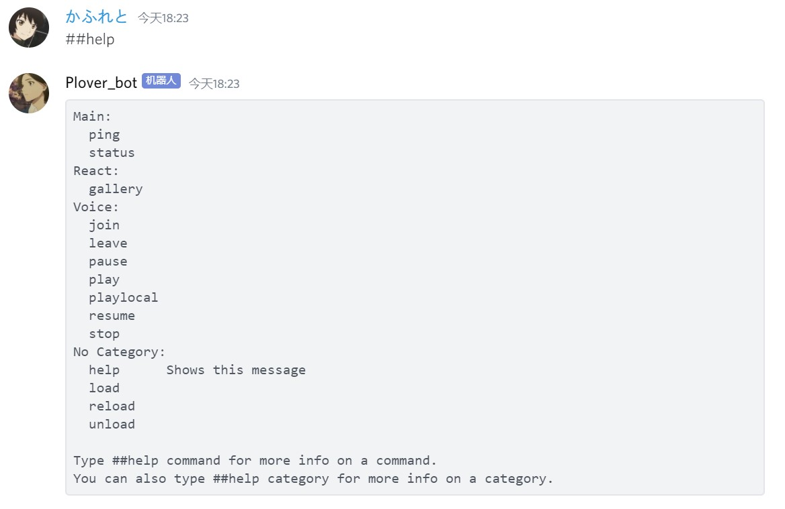

# Plover_bot

A discord bot that could play local musics

## Installation

* You need to [invite Plover_bot](https://discord.com/api/oauth2/authorize?) to your server first. 
* Clone this repository to your local linux machine, then run the code below in terminal

  ```bash
   python bot.py
  ``` 
## Usage

The affix of Plover_bot is ##
  
Specifically:
* ##Gallery returns a random picture among the collection downloaded from the official site of [Sing Yesterday](https://singyesterday.com/). Highly recommmended, absolutely will be in my TOP3 animes before I die.
* ##playlocal is deprecated. It is now integrated into ##play

## Developing
Python's Cog_Extension is being used to make developing and debugging single module easier. 
To implement your own commands:
* Commands are all in ./cmd, and each .py file correspond to a function module of Plover_bot.
* If a new module (i.e. collection of commands) is needed, just copy main.py and make your own changes.

Testing in your discord:
* You can test a single module by using ##load/##reload/##unload in your server's text channel. It would not cause any impact on the functioning of other modules.

## Contributing
Pull requests are welcome. For major changes, please open an issue first to discuss what you would like to change.

Please make sure to update tests as appropriate.
